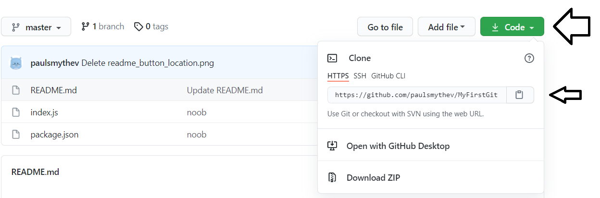

# MyFirstGit

This project is about leaning to use git locally and github through the use of cli and web.

Install instructions
1. Check to see if git is installed locally, open a terminal and run git --version
2. If no version of git is displayed, then it will need to be install from the link below
    - **[Git SCM](https://git-scm.com/)**
4. If you haven’t already created a github account create one at the link below
    - **[GitHub](https://github.com/)**
6. On the github website click on the “Start a project”
7. Give the repository a name as well as a brief description and select if the repository is public or private
8. Finally click on the “Create repository” button.

Run instructions
1. Create a project folder locally, then open it with visual studio code
2. Using CLI initialise git with following “git init”, which creates local repository
3. The next CLI requires the web URL of the project you created on github.com (located in the green buttom called code)

5. Looks similar to this “https://github.com/paulsmythev/MyFirstGit.git”
6. Run the command “git clone https://github.com/paulsmythev/MyFirstGit.git“. This copy’s the repository from online to local machine.
7. Create your program and when finished the following commands to upload changes
8. Using the “git add *” will start tracking a file you need
9. Run the following “git config --global user.email you@example.com” and “git config --global user.name "Your Name" replacing the email and name with your information
10. If need a msseage can be included using “git commit –m "message to describe changes"”
11. Lastly use “git push origin master” to update the git repository

| Week | Content |
| --- | --- |
| Week 1 | Introduction to NodeJS |
| Week 2 | Managing source control with version system |
| Week 3 | Mean Stack and serving static content |
| Week 4 | Angular - Frontend JavaScript Frameworks |
| Week 5 | Handling files, service, and local storage |
| Week 6 | Sockets |
| Week 7 | Doing Assignment |
| Week 8 | Introduction to NoSQL databases |
| Week 9 | NoSQL database queries |
| Week 10 | Unit testing frameworks and methodologies |
| Week 11 | End to end testing frameworks |
| Week 12 | Demonstrating Assignment |
